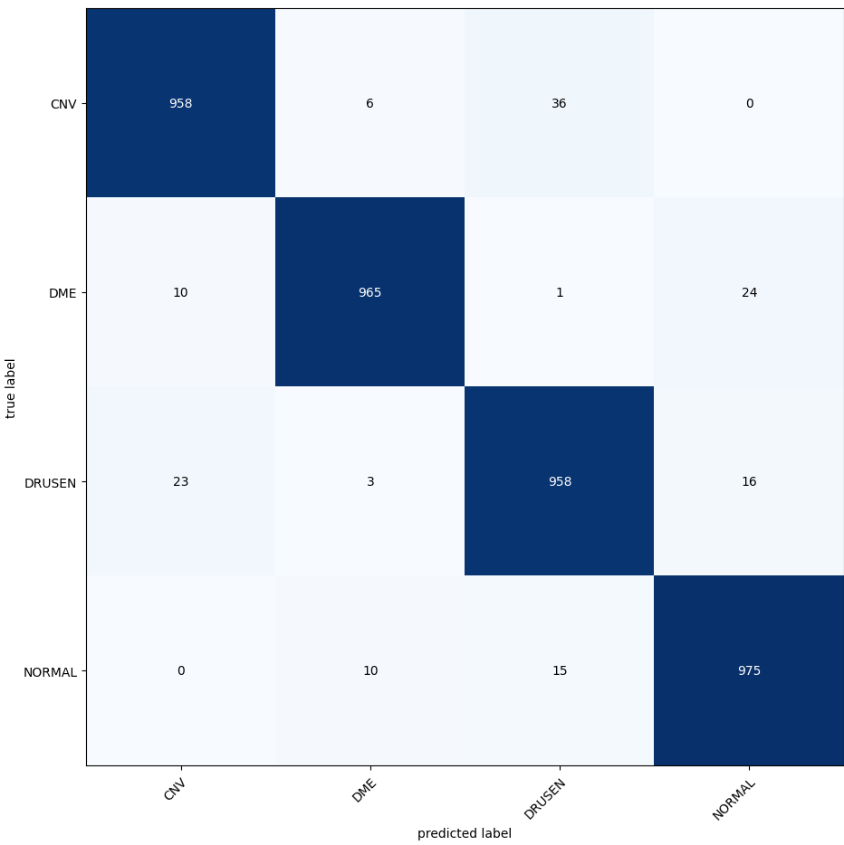
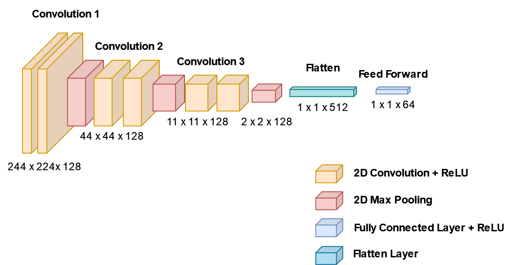
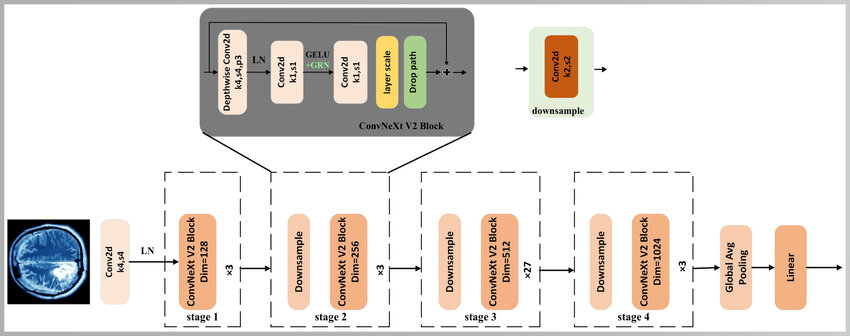
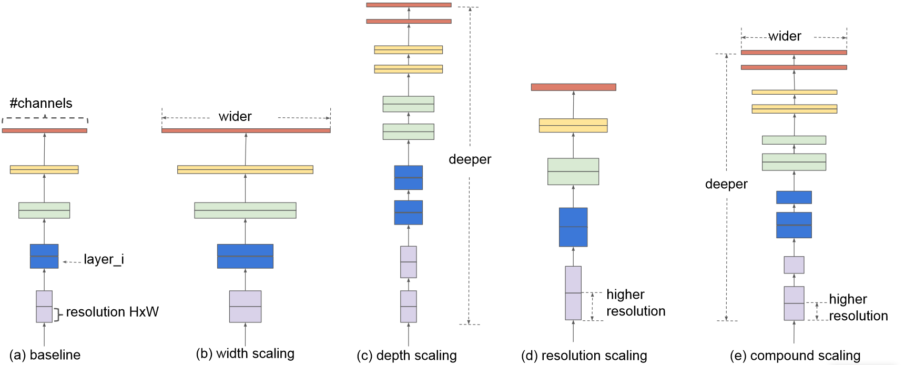

# Computer Vision Pipeline

Since I heard the [Podcast](https://www.youtube.com/watch?v=RF4LwRl0npQ&t=747s) with [Christof Henkel](https://www.kaggle.com/christofhenkel)  it became clear to me, that I want to develop my own robust and highly configurable ComputerVision model training
framework to automate most of the repetitive steps of model training and thus remove the need to create redundant and
poorly documented/tracked experiments.
This readme serves as a guide to explain how to use this framework, explain its inner workings and showcase its results
on a real world eye disease dataset.

| Model                                     | Pretrained         |
|-------------------------------------------|--------------------|
| [Efficientnet V2](#Efficientnet-V2)       | :heavy_check_mark: |
| [ConvNeXT V2](#ConvNeXT-V2)               | :heavy_check_mark: |
| [Vision Transformer](#Vision-Transformer) | :heavy_check_mark: |
| [Mini VGG](#Mini-VGG)                     | :x:                |

## Index

[Training Workflow](#Training-Workflow)<br>
[Demonstration Workflow](#Demonstration-Workflow)<br>
[Eye Disease Example](#Eye-Disease-Example)<br>
[Models](#Models)<br>
[User Guide](#User-Guide)<br>

## Training Workflow


## Demonstration Workflow


## Eye Disease Example

Dataset: [Eye Disease Detection Dataset](https://www.kaggle.com/datasets/ysnreddy/eye-disease-detection-dataset) <br>
Original Description by [Surya](https://www.kaggle.com/ysnreddy):<br>

Imagine, for a moment, a world where the beauty of a sunset, the colors of a rainbow, or the
joyful eyes of a loved one start to fade away, not due to the passage of time but because of
a lurking ocular disease. The reality is that millions across the globe face this daunting
experience daily, with conditions like CNV, DME, and Drusen leading the charge. But here's
where you, armed with the prowess of machine learning and a meticulously curated dataset,
can make an indelible mark and shine a beacon of hope in this looming darkness. <br>
Understanding the Adversaries: <br>
● CNV (Choroidal Neovascularization): An eye condition where abnormal blood
vessels grow underneath the retina. These vessels can leak blood and fluid, leading
to a bulge or bump in the macula.<br>
● DME (Diabetic Macular Edema): A consequence of diabetes, this condition is
characterized by fluid accumulation in the macula due to leaking blood vessels.
Without treatment, DME can lead to blindness.<br>
● Drusen: Tiny yellow or white deposits under the retina. They're common as we age,
but a large number in one place or their rapid increase can indicate a problem, such
as age-related macular degeneration (AMD).<br>
And then, of course, we have the eyes that are untouched by these conditions, categorized
under 'Normal'.<br>

Explanation:<br>

The Dataset Images were generated via a common eye disease diagnosing technique called Optical Coherence Tomographie (OTC). The main advantage of this technique is that it is non invasive and thereby does not cause any
discomfort in the patient. The goal of this example is to use the training data to train a model that generalizes well
on the unseen test data.

Example OTC Scan: <br>


## Step 0: Setup

I begin by downloading the [Dataset](https://www.kaggle.com/datasets/ysnreddy/eye-disease-detection-dataset) and putting
it into the directory classification/data. <br>
Next I add all train/test directories inside the dataset to the DemonstrationConfig values train_data_paths and
test_data_paths.<br>

```
train_data_paths: list[Union[str, os.PathLike]] = [
        r'classification/data/Eye_Disease_Detection/train/train']
test_data_paths: list[Union[str, os.PathLike]] = [
        r'classification/data/Eye_Disease_Detection/validation/validation']
```

## Step 1: First Experiments

Since the training process with the full dataset and huge models in this case takes multiple hours I decided to
experiment on a downsized version of the dataset with the smallest available model, which is MiniVGG. Additionally I
reduced the number of cross validation folds to 4, because otherwise the test split would contain to little samples for
my taste. You can achieve this via setting the following DemonstrationConfig parameters:<br>

```
model_name: str = 'MiniVGG'

# Cross Validation settings
num_folds: int = 4
...
# Data Settings
use_reduced_dataset: bool = True
reduced_percentage: float = .1
```

**Only relevant if you have a cuda compatible GPU**:
Next I opened my task manager and quickly experimented with training runs to determine the largest batch size my GPU can
load at once into memory and adapted the configuration parameter accordingly, which saves additional time during
experimenting.

```
# Train Settings
batch_size: int = 32  # recommended to be a power of 2, e.g. one of 2, 4, 8, 16, 32, ...
```

Next I conducted a full train run and noted the average accuracy of the best models across all 4 folds was around 90%,
which serves as the first value I am trying to beat through experimenting with augmentations.<br>
The first augmentation I would always recommend to try for image classification is
called [AutoAugment](https://arxiv.org/abs/1805.09501), which is a combination of Augmentations like translation,
rotation, or shearing which were optimized for huge common computer vision benchmarks
like [Imagenet](https://www.image-net.org/) and achieved state of the art results. Since the researchers were able to
demonstrate that these augmentation policies are transferable between datasets and thus useful for a multitude of
classification problems. You can find out more about this topic in the
original [paper](https://arxiv.org/abs/1805.09501).

```
augmentations = v2.Compose([v2.AutoAugment()])
```

Since auto augment improved my validation accuracy score to ~93%, which is a solid improvement for just using an
augmentation I decided to move on to create a learning rate schedule. Here I started with the
CosineAnnealingWarmRestarts schedule, which directly improved my accuracy score to ~96%.

```
# LR Scheduling
lr_scheduling: bool = True
lr_schedule_class: CosineAnnealingWarmRestarts
```

Since I know from my kaggle experience, that the larger, pretrained models tend to outperform the MiniVGG model this is
definitely good enough to likely get to an almost perfect accuracy. In addition to this there will be the opportunity to ensemble the
larger models for even better scores if need be. 
This lead to the decision to stop experimenting and moving on to training models with the full dataset.

## Step 2: Training with the full Dataset

Now is the time to train the models on the full data, here I started with the MiniVGG model, to see if our experiments 
generalize to the large dataset.
```
# Data Settings
use_reduced_dataset: bool = False
```
Now I go into main.py and run the function main(), which trains the models and creates some visualizations afterward.

## Step 3: Analyzing the results


What we see here is a 'Confusion Matrix' which has the true labels from the test data on the y-axis and the labels our
model predicted on the x-axis. Since the correct entries are on the main diagonal we can directly see how well our model
performed, which was ~96% validation accuracy like in our experiments, giving us confidence in moving on to bigger 
models which take more time to train. In addition to this we can detect the most common mistakes the model made 
during prediction and could try ot analyze these in order to reduce these errors. If this were a professional project I would take a look at 
the 36 images that were CNVs falsely predicted as drusen and try to find out why this is happening and how I can use this insight further improve the model, but since I have no need to cut down inference
costs or some use-case specific requirements limiting my model size I will circumvent the issue of 'just' 96% accuracy (remember that guessing here would be 25%) 
by transfer learning more powerful models.


Here I visualized 16 example images with their respective predicted label/true label above (written in green if the model predicted correctly, else written in red).

The next bigger Model we will train is called [ConvNeXt V2](#ConvNeXt-V2).

We begin by adapting the model_name parameter in the config to the model we want to train.
```
model_name: str = 'ConvNeXT_V2'
```
Next we just run main and wait for the results.

The best accuracy scores for our cross validation folds are:<br>
Fold 0: 0.977
Fold 1: 0.9815
Fold 2: 0.979
Fold 3: 0.983
Fold 4: 0.97
Fold 5: 0.987
Fold 6: 0.986
Fold 7: 0.977
Fold 8: 0.9855
Fold 9: 0.984
Average: 0.981


We get the following confusion matrix for the test dataset, which is unknown to the model: 

Since the Confusion matrix looks very similar to the MiniVGG Confusion matrix we start suspecting, that there might be 
some patterns present in the test data, which are not found in the train data. Also, we note that our cross validation 
slightly overestimated our models performance<br> 

Let's check out the EfficientNet confusion matrix:<br>


Last but not least we train the Vision Transformer which yields the following result:<br>


For the vision transformer I noted, that there were ~5% accuracy jumps between epochs, which suggests that the learning 
rate is too high, so I adjusted it as following:
```learning_rate: float = 5 * 10 ** -6```

Since the 4 confusion matrices look very much alike I suspect that there is some kind of pattern our training data does 
not contain or perhaps mislabeled data in the test set. 

## Step 4 Conclusion and further steps

We started by testing different configurations on a downsized train dataset and moved on to training models on the full 
dataset once we got satisfying results. Next we trained our 4 different models and got similar results, which suggests 
that there might be some patterns present in the test set we did not have in the training data. In a real world scenario
I suggest that you implement some explainability algorithm like [Grads Cam](https://arxiv.org/abs/1610.02391) to check 
if your model looks where it should look in order to classify the illnesses correctly.


## Models

### Mini VGG

Mini VGG is a downscaled version of [VGG](https://arxiv.org/abs/1409.1556), which is a well known Convolutional Neural Net.
While not as powerful as the other model options in the repository it is comparatively light-weight (~750.000) parameters, which makes it great for fast experimenting or usage on devices that lack a GPU.

### ConvNeXt V2

ConvNeXt V2 is a modernized Convolutional Neural Network which employs Convolutional Masked Auto-Encoding and Global Response Normalization to modernize the Convolutional Neural Net architecture. 

### EfficientNet V2

EfficientNet V2 is an improved version of EfficientNet, which is a model family that improved Convolutional Neural Nets through efficient scaling of depth width and resolution.

### Vision Transformer

The Vision Transformer is the first widely successful attempt to adapt the transformer who is dominating in Natural Language Problems (NLP) to the Computer Vision task and has been one of the top Computer Vision Classification algorithms since.   


