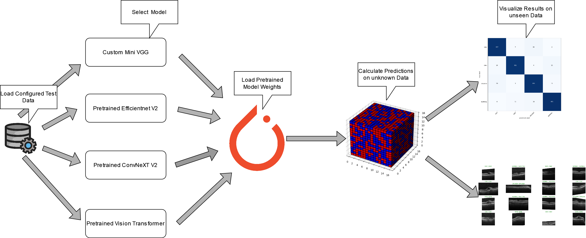

# Computer Vision Pipeline

Since I heard the [Podcast](https://www.youtube.com/watch?v=RF4LwRl0npQ&t=747s) with Christof Henkel (the guy who was the #1 competetive kaggler at that time) it became clear to me I want to develop my own ComputerVision model trianing framework to automate  most of the repetetive steps of model training and thus remove the need to create redundant and poorly documented/tracked experiments in notebooks.
This readme serves as a guide to explain how to use this framework, explain its inner workings and showcase its results on a real world eye disease dataset.

|Model                                      |Pretrained                   |
|-------------------------------------------|-----------------------------|
|[Efficientnet V2](###Efficientnet V2)      |:heavy_check_mark:           |
|[ConvNeXT V2](###ConvNeXT V2)              |:heavy_check_mark:           |
|[Vision Transformer](###Vision Transformer)|:heavy_check_mark:           |
|[Mini VGG](###Mini VGG)                    |:x:                          |

## Index
[Training Workflow](##Training Workflow) 
[Demonstration Workflow](##Demonstration Workflow) 
[User Guide](##User Guide) 
[Eye Disease Example](##Eye Disease Example) 
[Models](##Models) 

## Training Workflow

## Demonstration Workflow

