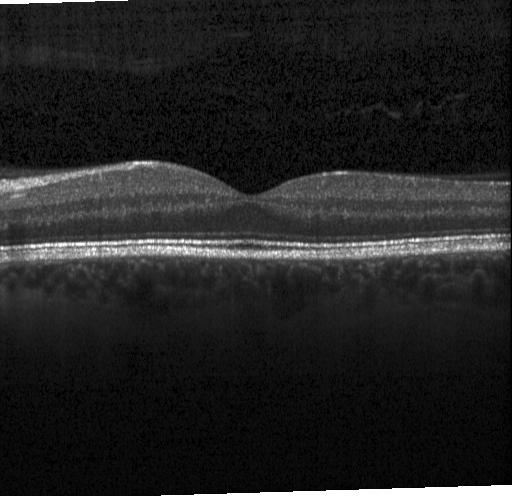
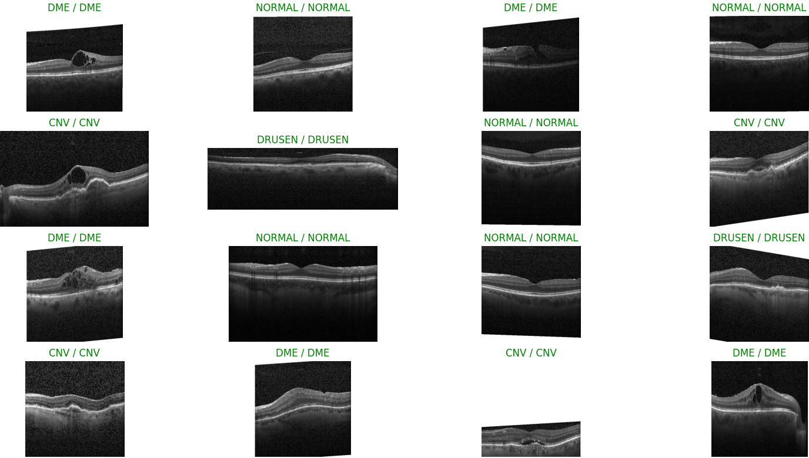

# Computer Vision Pipeline

Since I heard the [Podcast](https://www.youtube.com/watch?v=RF4LwRl0npQ&t=747s) with Christof Henkel (the guy who was
the #1 competetive kaggler at that time) it became clear to me I want to develop my own ComputerVision model trianing
framework to automate most of the repetetive steps of model training and thus remove the need to create redundant and
poorly documented/tracked experiments in notebooks.
This readme serves as a guide to explain how to use this framework, explain its inner workings and showcase its results
on a real world eye disease dataset.

| Model                                     | Pretrained         |
|-------------------------------------------|--------------------|
| [Efficientnet V2](#Efficientnet V2)       | :heavy_check_mark: |
| [ConvNeXT V2](#ConvNeXT V2)               | :heavy_check_mark: |
| [Vision Transformer](#Vision Transformer) | :heavy_check_mark: |
| [Mini VGG](#Mini VGG)                     | :x:                |

## Index

[Training Workflow](#Training-Workflow)<br>
[Demonstration Workflow](#Demonstration-Workflow)<br>
[Eye Disease Example](#Eye-Disease-Example)<br>
[Models](#Models)<br>
[User Guide](#User-Guide)<br>

## Training Workflow


## Demonstration Workflow


## Eye Disease Example

Dataset: [Eye Disease Detection Dataset](https://www.kaggle.com/datasets/ysnreddy/eye-disease-detection-dataset) <br>
Original Description by [Surya](https://www.kaggle.com/ysnreddy):<br>

Imagine, for a moment, a world where the beauty of a sunset, the colors of a rainbow, or the
joyful eyes of a loved one start to fade away, not due to the passage of time but because of
a lurking ocular disease. The reality is that millions across the globe face this daunting
experience daily, with conditions like CNV, DME, and Drusen leading the charge. But here's
where you, armed with the prowess of machine learning and a meticulously curated dataset,
can make an indelible mark and shine a beacon of hope in this looming darkness. <br>
Understanding the Adversaries: <br>
● CNV (Choroidal Neovascularization): An eye condition where abnormal blood
vessels grow underneath the retina. These vessels can leak blood and fluid, leading
to a bulge or bump in the macula.<br>
● DME (Diabetic Macular Edema): A consequence of diabetes, this condition is
characterized by fluid accumulation in the macula due to leaking blood vessels.
Without treatment, DME can lead to blindness.<br>
● Drusen: Tiny yellow or white deposits under the retina. They're common as we age,
but a large number in one place or their rapid increase can indicate a problem, such
as age-related macular degeneration (AMD).<br>
And then, of course, we have the eyes that are untouched by these conditions, categorized
under 'Normal'.<br>

Explanation:<br>

The Dataset Images were generated via a common eye disease diagnosing technique called Optical Coherence Tomographie (
OTC) and labeled. The main advantage of this technique is that it is non invasive and thereby does not cause any
discomfort in the patient. The goal of this example is to use the training data to train a model that generalizes well
on the unseen test data we will use to measure the models performance.

Example OTC Scan: <br>


## Step 0: Setup

I begin by downloading the [Dataset](https://www.kaggle.com/datasets/ysnreddy/eye-disease-detection-dataset) and putting
it into the directory classification/data. <br>
Next I add all train/test directories inside the dataset to the DemonstrationConfig values train_data_paths and
test_data_paths.<br>

```
train_data_paths: list[Union[str, os.PathLike]] = [
        r'classification/data/Eye_Disease_Detection/train/train']
test_data_paths: list[Union[str, os.PathLike]] = [
        r'classification/data/Eye_Disease_Detection/validation/validation']
```

## Step 1: First Experiments

Since the training process with the full dataset and huge models in this case takes multiple hours I decided to
experiment on a downsized version of the dataset with the smallest available model, which is MiniVGG. Additionally I
reduced the number of cross validation folds to 4, because otherwise the test split would contain to little samples for
my taste. You can achieve this via setting the following DemonstrationConfig parameters:<br>

```
model_name: str = 'MiniVGG'

# Cross Validation settings
num_folds: int = 4
...
# Data Settings
use_reduced_dataset: bool = True
reduced_percentage: float = .1
```

**Only relevant if you have a cuda compatible GPU**:
Next I opened my task manager and quickly experimented with training runs to determine the largest batch size my GPU can
load at once into memory and adapted the configuration parameter accordingly, which saves additional time during
experimenting.

```
# Train Settings
batch_size: int = 32  # recommended to be a power of 2, e.g. one of 2, 4, 8, 16, 32, ...
```

Next I conducted a full train run and noted the average accuracy of the best models across all 4 folds was around 90%,
which serves as the first value I am trying to beat through experimenting with augmentations.<br>
The first augmentation I would always recommend to try for image classification is
called [AutoAugment](https://arxiv.org/abs/1805.09501), which is a combination of Augmentations like translation,
rotation, or shearing which were optimized for huge common computer vision benchmarks
like [Imagenet](https://www.image-net.org/) and achieved state of the art results. Since the researchers were able to
demonstrate that these augmentation policies are transferable between datasets and thus useful for a multitude of
classification problems. You can find out more about this topic in the
original [paper](https://arxiv.org/abs/1805.09501).

```
augmentations = v2.Compose([v2.AutoAugment()])
```

Since auto augment improved my validation accuracy score to ~93%, which is a solid improvement for just using an
augmentation I decided to move on to create a learning rate schedule. Here I started with the
CosineAnnealingWarmRestarts schedule, which directly improved my accuracy score to ~96%.

```
# LR Scheduling
lr_scheduling: bool = True
lr_schedule_class: CosineAnnealingWarmRestarts
```

Since I know from my kaggle experience, that the larger, pretrained models tend to outperform the MiniVGG model by 2-5% accuracy score this is
definitely good enough to likely get to an almost perfect accuracy. Additionally there will be the opportunity to ensemble the
larger models for even better scores if need be. 
This lead to the decision to stop experimenting and moving on to training models with the full dataset.

## Step 2: Training with the full Dataset

Now is the time to train the models on the full data, here I started with the MiniVGG model, to see if our experiments 
generalize to the large dataset.
```
# Data Settings
use_reduced_dataset: bool = False
```
Now I go into main.py and run the function main(), which trains the models and creates some visualizations afterward.

## Step 3: Analyzing the results


What we see her eis a so called 'Confusion Matrix'





